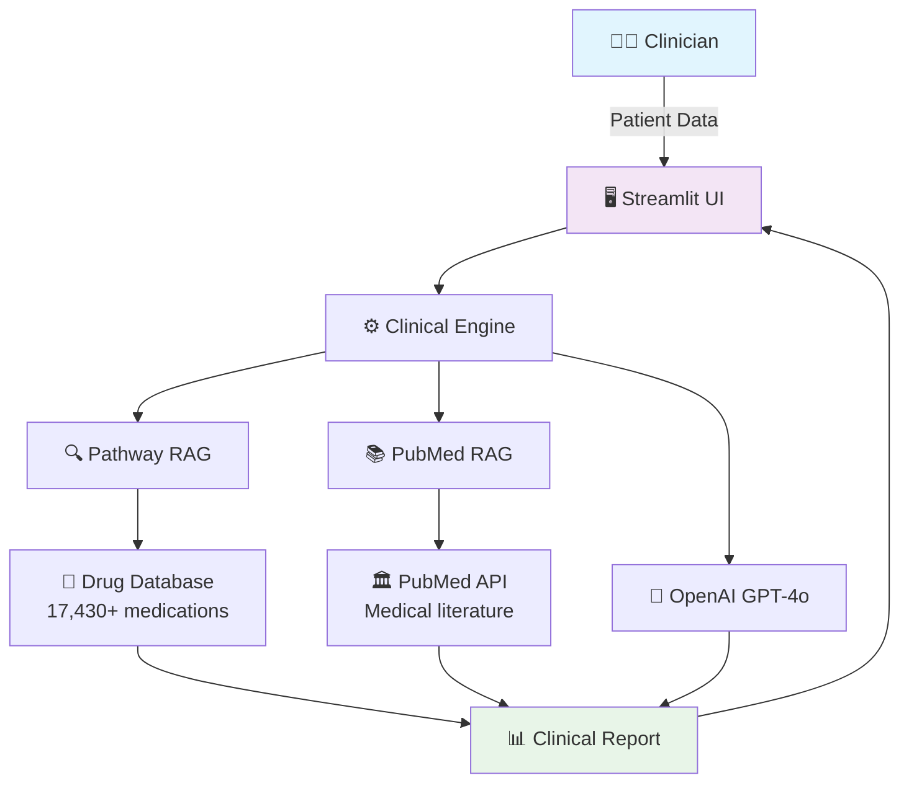

# 🏥 MedCare AI – Intelligent Clinical Decision Support System

<div align="center">

[](https://www.python.org/downloads/)
[](https://opensource.org/licenses/MIT)
[](https://openai.com/)
[](https://pathway.com/)
[](https://www.ncbi.nlm.nih.gov/books/NBK25501/)

**🏆 Pathway Hackathon October 2025 Submission**

*AI-Powered Clinical Decision Support with Real-Time Medical Literature Integration*

[🚀 Quick Start](#-quick-start) •
[📖 Documentation](#-documentation) •
[💻 Demo](#-demo) •
[🤝 Contributing](#-contributing)

</div>

---

## 📋 Overview

MedCare AI is an advanced Clinical Decision Support System that revolutionizes healthcare decision-making by combining:

- **🔄 Real-time medical literature retrieval** from PubMed
- **💊 Intelligent drug interaction analysis** (17,430+ medications)  
- **🤖 AI-powered clinical recommendations** via GPT-4o-mini
- **⚡ High-performance vector search** using Pathway RAG

Built for the **Pathway Hackathon October 2025**, demonstrating the power of real-time RAG in healthcare AI.

## ✨ Key Features

<table>
<tr>
<td width="50%">

### 🧬 Clinical Intelligence
- **Patient Analysis**: Comprehensive symptom & history assessment
- **Risk Stratification**: AI-powered clinical risk evaluation  
- **Treatment Recommendations**: Evidence-based guidance
- **Drug Safety**: Real-time interaction checking

</td>
<td width="50%">

### 📚 Research Integration  
- **Live PubMed Search**: Automatic literature retrieval
- **Semantic Ranking**: Relevance-based evidence scoring
- **Evidence Synthesis**: AI-powered research summaries
- **Citation Management**: Direct PubMed links & metadata

</td>
</tr>
</table>

## 🚀 Quick Start

### Option 1: Docker (Recommended)

```bash
# Clone repository
git clone https://github.com/Sukesh-Periyasamy/pathway_rag.git
cd pathway_rag

# Set your OpenAI API key
export OPENAI_API_KEY="sk-your-key-here"

# Start services
docker-compose up -d

# Access application
open http://localhost:8505
```

### Option 2: Local Development

```bash
# Setup environment
python -m venv venv
source venv/bin/activate  # Windows: venv\Scripts\activate
pip install -r requirements.txt

# Configure environment
cp .env.example .env
# Edit .env with your API keys

# Start Pathway RAG server
python -m pathway.xpacks.llm.run_server &

# Launch Streamlit app  
streamlit run src/ui/main_app.py
```

## 🏗️ Architecture



## 📊 System Capabilities

| Component | Technology | Scale |
|-----------|------------|-------|
| **Drug Interactions** | Pathway Vector DB | 17,430+ medications |
| **Literature Search** | PubMed E-Utilities | Real-time API access |
| **AI Analysis** | OpenAI GPT-4o-mini | Clinical reasoning |
| **Embeddings** | SentenceTransformers | Semantic similarity |
| **Interface** | Streamlit | Interactive dashboard |

## 🔧 API Usage

### Patient Analysis

```bash
curl -X POST http://localhost:8008/v1/pw_ai_answer \
  -H "Content-Type: application/json" \
  -d '{
    "query": "analyze_patient",
    "patient_data": {
      "conditions": ["Type 2 Diabetes", "Hypertension"],
      "medications": ["Metformin 1000mg", "Lisinopril 10mg"],
      "symptoms": ["Fatigue", "Blurred vision"],
      "vital_signs": {
        "blood_pressure": "150/95 mmHg",
        "heart_rate": "88 bpm"
      },
      "lab_results": {
        "hba1c": "8.2%",
        "creatinine": "1.8 mg/dL"
      }
    }
  }'
```

### Response Format

```json
{
  "clinical_summary": {
    "primary_concerns": ["Poorly controlled diabetes", "Stage 3B CKD"],
    "risk_assessment": "High cardiovascular risk"
  },
  "recommendations": {
    "immediate": [
      {
        "priority": "High",
        "action": "Diabetes medication optimization",
        "evidence_level": "Grade A"
      }
    ],
    "research_evidence": [
      {
        "title": "SGLT2 Inhibitors in CKD",
        "pmid": "34449189",
        "relevance_score": 0.94
      }
    ]
  }
}
```

## 📁 Project Structure

```
MedCare_AI_CDSS/
├── 🐳 docker-compose.yml       # Container orchestration
├── 📦 requirements.txt         # Python dependencies  
├── 🏥 patient_records/         # Sample patient data
├── 💻 src/
│   ├── core/
│   │   ├── clinical_engine.py  # Main analysis engine
│   │   └── pathway_pubmed_patient_rag.py  # PubMed integration
│   ├── ui/
│   │   └── main_app.py         # Streamlit dashboard
│   └── utils/
│       └── config.py           # Configuration
└── 🧪 tests/                   # Test suites
```

## ⚙️ Configuration

Create `.env` file:

```bash
# OpenAI Configuration
OPENAI_API_KEY=sk-your-key-here
OPENAI_MODEL=gpt-4o-mini

# PubMed Configuration  
PUBMED_EMAIL=your-email@domain.com
PUBMED_MAX_RESULTS=10

# Application Settings
PATHWAY_HOST=localhost
PATHWAY_PORT=8008
STREAMLIT_PORT=8505
DEBUG_MODE=false
```

## 🛠️ Technology Stack

- **🧠 AI/ML**: OpenAI GPT-4o-mini, SentenceTransformers, BioBERT
- **🗄️ Data**: Pathway RAG, PubMed E-Utilities, DrugBank, FAISS
- **🖥️ Frontend**: Streamlit, Interactive Dashboard
- **⚙️ Backend**: FastAPI (via Pathway), REST APIs
- **📊 Processing**: Pandas, NumPy, Scikit-learn
- **🐳 Deployment**: Docker, Docker Compose

## 💻 Demo

### Sample Patient Analysis

The system includes 8 comprehensive patient records for testing:

- **Margaret Johnson** (P001234) - Diabetes + Hypertension
- **Robert Chen** (P005678) - COPD + Heart Failure  
- **Sarah Williams** (P009123) - Anxiety + Depression
- **James Rodriguez** (P007890) - Chronic Pain + Sleep Disorders

### Clinical Dashboard Features

1. **Patient Input** - Comprehensive clinical data entry
2. **AI Analysis** - Real-time clinical assessment  
3. **Research Evidence** - Live PubMed integration
4. **Drug Safety** - Interaction checking & alerts
5. **Clinical Reports** - PDF generation for documentation

## 🚀 Future Roadmap

### Phase 1 (Q1 2026)
- [ ] HIPAA compliance module
- [ ] Mobile application (React Native)
- [ ] Clinical guidelines integration
- [ ] Multi-language support

### Phase 2 (Q2-Q3 2026)  
- [ ] EHR system integration
- [ ] Predictive analytics models
- [ ] Genomic data support
- [ ] Federated learning capabilities

## 🤝 Contributing

We welcome contributions! Please see our [contribution guidelines](CONTRIBUTING.md).

1. Fork the repository
2. Create feature branch (`git checkout -b feature/amazing-feature`)
3. Commit changes (`git commit -m 'Add amazing feature'`)
4. Push to branch (`git push origin feature/amazing-feature`)
5. Open Pull Request

## 📄 License

This project is licensed under the MIT License - see [LICENSE](LICENSE) file for details.

## ⚠️ Medical Disclaimer

> **🩺 For Healthcare Professionals Only**
> 
> This system is designed as a clinical decision support tool for qualified healthcare professionals. It should not replace clinical judgment or serve as the sole basis for medical decisions. Always validate recommendations with current clinical guidelines.

## 🙏 Acknowledgments

- **[Pathway Team](https://pathway.com/)** - RAG framework and vector database
- **[NCBI/PubMed](https://www.ncbi.nlm.nih.gov/)** - Medical literature database
- **[OpenAI](https://openai.com/)** - Language model technology
- **Healthcare professionals** - Domain expertise and validation

---

<div align="center">

**🌟 Star this repository if it helped you! 🌟**

Made with ❤️ for **Pathway Hackathon October 2025**

[🏠 Home](https://github.com/Sukesh-Periyasamy/pathway_rag) • 
[📚 Docs](docs/) • 
[🐛 Issues](https://github.com/Sukesh-Periyasamy/pathway_rag/issues) • 
[💡 Features](https://github.com/Sukesh-Periyasamy/pathway_rag/issues)

</div>