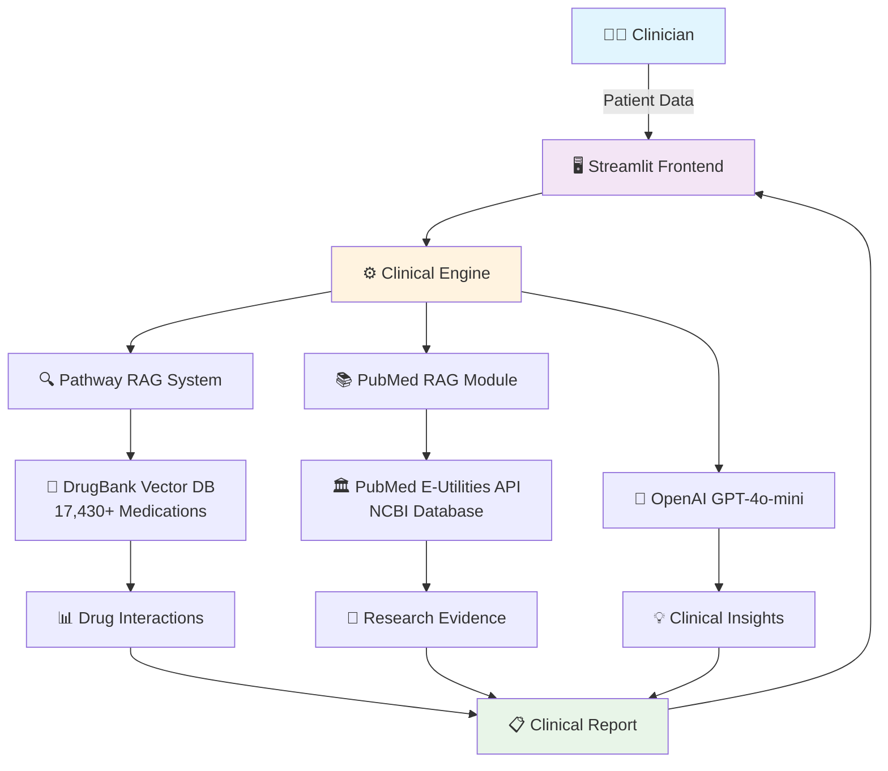

# 🏥 MedCare AI – Intelligent Clinical RAG System

[](https://www.python.org/downloads/)
[](https://opensource.org/licenses/MIT)
[](https://openai.com/)
[](https://pathway.com/)
[](https://www.ncbi.nlm.nih.gov/books/NBK25501/)
[](https://pathway.com/hackathon)

> 🏆 **Pathway Hackathon October 2025 Submission - Healthcare AI Track**  
> 🚀 **Personalized Evidence-Based Treatment through AI-Powered Clinical Decision Support**

**Submitted to Pathway Hackathon October 2025** - MedCare AI is an advanced Clinical Decision Support System that revolutionizes healthcare decision-making by combining real-time medical literature retrieval, intelligent drug interaction analysis, and AI-powered clinical recommendations. Built with cutting-edge **Pathway RAG** technology, PubMed E-Utilities API, and OpenAI's language models to showcase the power of real-time vector databases in healthcare AI applications.

### 🎯 **Hackathon Innovation Highlights**
- ⚡ **Real-Time RAG**: Demonstrates Pathway's streaming capabilities with live medical literature integration
- 🧬 **Vector-Powered Clinical Intelligence**: 17,430+ drug interactions processed through Pathway's high-performance vector engine
- 🔄 **Live Data Pipeline**: Real-time PubMed research retrieval with semantic similarity ranking
- 🏥 **Production-Ready Healthcare AI**: Complete clinical workflow from patient input to evidence-based recommendations

---

## 🌟 Key Features

### 🧬 **Intelligent Patient Analysis**
- **JSON-based Patient Input**: Structured patient data processing via REST API
- **Comprehensive Clinical Assessment**: Automated analysis of symptoms, conditions, and medical history
- **Multi-Modal Recommendations**: Immediate, monitoring, and research-based clinical guidance

### 📚 **Automated PubMed Research Integration**
- **Real-Time Literature Search**: Automatic query generation from patient conditions
- **Semantic Similarity Ranking**: Advanced embedding-based relevance scoring
- **Evidence Synthesis**: AI-powered summarization of recent medical research
- **Rate-Limited API Access**: Compliant with NCBI E-Utilities guidelines (≤10 req/sec)

### 💊 **Advanced Drug Safety System**
- **Comprehensive Drug Database**: 17,430+ medications with interaction profiles
- **Real-Time Interaction Checking**: Cross-referencing patient medications
- **Clinical Guidelines Integration**: Evidence-based prescribing recommendations

### 🎯 **Intelligent Vector Search & RAG**
- **Pathway-Powered RAG**: High-performance vector database for medical knowledge
- **Semantic Embeddings**: SentenceTransformers with clinical domain optimization
- **Top-K Retrieval**: Contextually relevant medical information extraction

### 📊 **Clinical Dashboard & Visualization**
- **Streamlit Interface**: Interactive web-based clinical workstation
- **Comprehensive Data Entry**: 20+ vital signs fields, 30+ lab result categories
- **Research Evidence Display**: Structured presentation with PubMed links and metadata
- **Patient Management**: Sample patient records and clinical workflow tools

---

## 🏗️ System Architecture



### 🔄 **Data Flow Process**

1. **Patient Input** → Clinician enters comprehensive patient data via Streamlit interface
2. **Clinical Analysis** → Multi-engine processing through Pathway RAG and OpenAI integration
3. **Literature Retrieval** → Automated PubMed searches based on patient conditions
4. **Evidence Synthesis** → AI-powered analysis of drug interactions and research findings
5. **Clinical Output** → Structured recommendations with supporting evidence and metadata

---

## 🛠️ Installation Guide

### 📋 **Prerequisites**

- **Python**: ≥ 3.10
- **pip**: Latest version
- **OpenAI API Key**: [Get your API key](https://platform.openai.com/api-keys)
- **PubMed API Access**: [NCBI E-Utilities](https://www.ncbi.nlm.nih.gov/books/NBK25497/) (no key required, rate-limited)

### ⚡ **Quick Start with Docker**

> 💡 **Recommended for production deployment**

```bash
# Clone the repository
git clone https://github.com/yourusername/medcare-ai-cdss.git
cd medcare-ai-cdss

# Build and run with Docker Compose
docker-compose up -d

# Access the application
# Frontend: http://localhost:8505
# Backend:  http://localhost:8008
```

### 🐍 **Local Development Setup**

```bash
# 1. Clone the repository
git clone https://github.com/yourusername/medcare-ai-cdss.git
cd medcare-ai-cdss

# 2. Create virtual environment
python -m venv medcare_env
source medcare_env/bin/activate  # On Windows: medcare_env\Scripts\activate

# 3. Install dependencies
pip install -r requirements.txt

# 4. Set up environment variables
cp .env.example .env
# Edit .env with your API keys (see Environment Variables section)

# 5. Initialize sample data
python demo_sample_data.py

# 6. Start the Pathway RAG server
python -m pathway.xpacks.llm.run_server &

# 7. Launch the Streamlit application
streamlit run src/ui/main_app.py
```

### 🧪 **Testing the Installation**

```bash
# Run integration tests
python test_pubmed_integration.py

# Test with sample patient data
curl -X POST http://localhost:8008/analyze \
  -H "Content-Type: application/json" \
  -d @demo/sample_patient.json
```

---

## ⚙️ Environment Variables

Create a `.env` file in the project root with the following configuration:

```bash
# 🤖 OpenAI Configuration
OPENAI_API_KEY=sk-your-openai-api-key-here
OPENAI_MODEL=gpt-4o-mini
OPENAI_TEMPERATURE=0.3
OPENAI_MAX_TOKENS=2000

# 🔬 PubMed Configuration  
PUBMED_EMAIL=your-email@domain.com  # Required for NCBI API
PUBMED_TOOL=MedCare_AI_CDSS
PUBMED_MAX_RESULTS=10
PUBMED_RATE_LIMIT=10  # requests per second

# 🧠 Embeddings Configuration
EMBEDDER_MODEL=all-mpnet-base-v2
CLINICAL_EMBEDDER_MODEL=pritamdeka/BioBERT-Base-NLI
EMBEDDING_DIMENSION=768

# 🗄️ Vector Database Configuration
PATHWAY_HOST=localhost
PATHWAY_PORT=8008
VECTOR_INDEX_PATH=./data/vector_indices/

# 🌐 Application Configuration
STREAMLIT_PORT=8505
DEBUG_MODE=false
LOG_LEVEL=INFO
MAX_UPLOAD_SIZE=200MB

# 📊 Clinical Configuration
DRUG_INTERACTION_THRESHOLD=0.7
CLINICAL_RELEVANCE_THRESHOLD=0.6
MAX_RECOMMENDATIONS=10
```

> ⚠️ **Security Note**: Never commit your `.env` file to version control. Add it to `.gitignore`.

---

## 🚀 Example Usage

### 📤 **Patient Data Submission**

```bash
curl -X POST http://localhost:8008/v1/pw_ai_answer \
  -H "Content-Type: application/json" \
  -d '{
    "query": "analyze_patient",
    "patient_data": {
      "patient_info": {
        "name": "John Smith",
        "age": 65,
        "gender": "Male",
        "weight": "180 lbs",
        "height": "5'\''10'\''"
      },
      "medical_history": {
        "conditions": ["Type 2 Diabetes", "Hypertension", "Chronic Kidney Disease"],
        "medications": ["Metformin 1000mg", "Lisinopril 10mg", "Atorvastatin 20mg"],
        "allergies": ["Penicillin", "Sulfa drugs"]
      },
      "current_symptoms": ["Fatigue", "Blurred vision", "Frequent urination"],
      "vital_signs": {
        "blood_pressure": "150/95 mmHg",
        "heart_rate": "88 bpm",
        "temperature": "98.6°F",
        "respiratory_rate": "16/min",
        "oxygen_saturation": "97%"
      },
      "lab_results": {
        "hba1c": "8.2%",
        "creatinine": "1.8 mg/dL",
        "egfr": "35 mL/min/1.73m²",
        "ldl_cholesterol": "145 mg/dL"
      }
    }
  }'
```

### 📥 **Clinical Response Example**

```json
{
  "patient_id": "patient_12345",
  "analysis_timestamp": "2025-10-18T14:30:00Z",
  "clinical_summary": {
    "primary_concerns": [
      "Poorly controlled diabetes (HbA1c 8.2%)",
      "Stage 3B chronic kidney disease",
      "Hypertension with target organ damage"
    ],
    "risk_assessment": "High cardiovascular and renal risk"
  },
  "recommendations": {
    "immediate": [
      {
        "priority": "High",
        "action": "Diabetes medication optimization",
        "description": "Consider adding SGLT2 inhibitor for renal protection",
        "evidence_level": "Grade A"
      }
    ],
    "monitoring": [
      {
        "parameter": "Kidney function",
        "frequency": "Every 3 months",
        "target": "Prevent further decline in eGFR"
      }
    ],
    "research_based": [
      {
        "title": "SGLT2 Inhibitors in CKD and Diabetes",
        "evidence_source": "pubmed_literature",
        "relevance_score": 0.94,
        "supporting_studies": [
          {
            "pmid": "34449189",
            "title": "Cardiovascular and Renal Outcomes with Empagliflozin in Heart Failure",
            "pubdate": "2021-08-27",
            "relevance": "High",
            "doi": "10.1056/NEJMoa2022190"
          }
        ]
      }
    ]
  },
  "drug_interactions": {
    "warnings": [
      {
        "severity": "Moderate",
        "interaction": "Lisinopril + High creatinine",
        "recommendation": "Monitor kidney function closely"
      }
    ]
  },
  "patient_education": {
    "key_points": [
      "Importance of blood sugar monitoring",
      "Dietary modifications for CKD",
      "Recognition of hypoglycemia symptoms"
    ]
  }
}
```

### 🖥️ **Streamlit Interface Usage**

1. **Access Dashboard**: Navigate to `http://localhost:8505`
2. **Load Patient**: Select from sample patients or create new patient profile
3. **Enter Clinical Data**: Use the comprehensive forms for vital signs and lab results
4. **Generate Analysis**: Click "Analyze Patient" to trigger AI assessment
5. **Review Results**: Explore recommendations, research evidence, and drug interactions
6. **Export Report**: Generate PDF clinical reports for documentation

---

## 📁 Project Structure

```
MedCare_AI_CDSS/
├── 📊 data/                          # Data storage and processing
│   ├── drug_interactions/            # DrugBank interaction data
│   ├── vector_indices/              # Pathway vector database files
│   └── clinical_guidelines/         # Medical guideline references
├── 📋 demo/                          # Demo scripts and sample data
│   ├── sample_patients/             # Example patient JSON files
│   └── demo_scenarios.py           # Interactive demo scenarios  
├── 📚 docs/                          # Documentation and guides
│   ├── api_reference.md            # API endpoint documentation
│   ├── clinical_workflows.md       # Healthcare professional guides
│   └── deployment_guide.md         # Production deployment instructions
├── 📝 logs/                          # Application logs and monitoring
├── 🏥 patient_records/              # Sample patient database
├── 🧪 scripts/                       # Utility and maintenance scripts  
│   ├── fresh_start.py              # Environment reset utility
│   ├── start_demo.bat              # Windows demo launcher
│   └── test_docker_deployment.py   # Docker testing script
├── 💻 src/                           # Main application source code
│   ├── core/                       # Core business logic
│   │   ├── clinical_engine.py      # 🧠 Main clinical analysis engine
│   │   └── pathway_pubmed_patient_rag.py  # 📚 PubMed RAG integration
│   ├── ui/                         # User interface components
│   │   └── main_app.py             # 🖥️ Streamlit dashboard application
│   └── utils/                      # Helper functions and utilities
│       └── config.py               # ⚙️ Configuration management
├── 🧪 tests/                         # Test suites and validation
│   ├── test_clinical_engine.py     # Clinical logic tests
│   ├── test_drugbank_vectordb.py   # Drug database tests
│   ├── test_gpt_integration.py     # OpenAI integration tests
│   └── test_pdf_generation.py      # Report generation tests
├── 🐳 docker-compose.yml            # Multi-container orchestration
├── 🐳 Dockerfile                    # Container image definition
├── 📦 requirements.txt              # Python dependencies
├── ⚙️ setup.py                      # Package installation script
└── 📄 README.md                     # Project documentation (this file)
```

---

## 🔧 Technologies Used

### 🧠 **AI & Machine Learning**
- **[OpenAI GPT-4o-mini](https://openai.com/)**: Advanced language model for clinical analysis and synthesis
- **[SentenceTransformers](https://www.sbert.net/)**: Semantic embeddings with `all-mpnet-base-v2` model
- **[BioBERT](https://huggingface.co/pritamdeka/BioBERT-Base-NLI)**: Biomedical domain-specific embeddings

### 🗄️ **Data & Retrieval**
- **[Pathway](https://pathway.com/)**: High-performance RAG framework for real-time vector operations
- **[PubMed E-Utilities](https://www.ncbi.nlm.nih.gov/books/NBK25501/)**: NCBI's API for medical literature access
- **[DrugBank](https://go.drugbank.com/)**: Comprehensive pharmaceutical database integration
- **[FAISS](https://github.com/facebookresearch/faiss)**: Efficient similarity search and clustering

### 🖥️ **Frontend & Backend**
- **[Streamlit](https://streamlit.io/)**: Interactive web application framework
- **[FastAPI](https://fastapi.tiangolo.com/)**: High-performance REST API backend (via Pathway)
- **[Docker](https://www.docker.com/)**: Containerization for consistent deployment

### 📊 **Data Processing**
- **[Pandas](https://pandas.pydata.org/)**: Data manipulation and analysis
- **[NumPy](https://numpy.org/)**: Numerical computing foundation
- **[Scikit-learn](https://scikit-learn.org/)**: Machine learning utilities
- **[ReportLab](https://www.reportlab.com/)**: PDF clinical report generation

---

## 🚀 Future Enhancements

### 📈 **Near-term Roadmap (Q1 2026)**
- 🩺 **Clinical Guidelines Integration**: Automated retrieval from medical society guidelines
- 📱 **Mobile Application**: React Native app for point-of-care access  
- 🔐 **HIPAA Compliance Module**: Enhanced security and audit logging
- 🌐 **Multi-language Support**: Internationalization for global healthcare systems

### 🔬 **Advanced Features (Q2-Q3 2026)**
- 🧬 **Genomic Data Integration**: Pharmacogenomics and precision medicine
- 📊 **Predictive Analytics**: Machine learning models for outcome prediction
- 🔄 **Continuous Learning**: Model updates from anonymized clinical feedback
- 🏥 **EHR Integration**: Direct connectivity with major electronic health record systems

### 🌍 **Research & Development (Q4 2026+)**
- 🤖 **Federated Learning**: Privacy-preserving multi-institutional model training
- 🧪 **Clinical Trial Matching**: Automated patient-trial compatibility assessment
- 📈 **Real-world Evidence**: Integration of post-market surveillance data
- 🔬 **Laboratory AI**: Automated diagnostic interpretation and recommendations

---

## 🤝 Contributing

We welcome contributions from healthcare professionals, developers, and researchers! Please see our [Contributing Guidelines](CONTRIBUTING.md) for details.

### 👥 **How to Contribute**
1. **🍴 Fork** the repository
2. **🌿 Create** a feature branch (`git checkout -b feature/AmazingFeature`)
3. **💾 Commit** your changes (`git commit -m 'Add some AmazingFeature'`)
4. **📤 Push** to the branch (`git push origin feature/AmazingFeature`)
5. **🔄 Open** a Pull Request

### 🐛 **Bug Reports & Feature Requests**
Please use our [GitHub Issues](https://github.com/yourusername/medcare-ai-cdss/issues) template for reporting bugs or suggesting enhancements.

---

## 📜 License

This project is licensed under the **MIT License** - see the [LICENSE](LICENSE) file for details.

```
MIT License

Copyright (c) 2025 MedCare AI Development Team - Pathway Hackathon October 2025

Permission is hereby granted, free of charge, to any person obtaining a copy
of this software and associated documentation files (the "Software"), to deal
in the Software without restriction, including without limitation the rights
to use, copy, modify, merge, publish, distribute, sublicense, and/or sell
copies of the Software, and to permit persons to whom the Software is
furnished to do so, subject to the following conditions:

The above copyright notice and this permission notice shall be included in all
copies or substantial portions of the Software.

THE SOFTWARE IS PROVIDED "AS IS", WITHOUT WARRANTY OF ANY KIND, EXPRESS OR
IMPLIED, INCLUDING BUT NOT LIMITED TO THE WARRANTIES OF MERCHANTABILITY,
FITNESS FOR A PARTICULAR PURPOSE AND NONINFRINGEMENT. IN NO EVENT SHALL THE
AUTHORS OR COPYRIGHT HOLDERS BE LIABLE FOR ANY CLAIM, DAMAGES OR OTHER
LIABILITY, WHETHER IN AN ACTION OF CONTRACT, TORT OR OTHERWISE, ARISING FROM,
OUT OF OR IN CONNECTION WITH THE SOFTWARE OR THE USE OR OTHER DEALINGS IN THE
SOFTWARE.
```

---

## 🙏 Acknowledgements

### 🏛️ **Data Sources & APIs**
- **[National Center for Biotechnology Information (NCBI)](https://www.ncbi.nlm.nih.gov/)**: PubMed database and E-Utilities API
- **[DrugBank](https://go.drugbank.com/)**: Comprehensive drug and drug interaction database
- **[OpenAI](https://openai.com/)**: Advanced language models for clinical AI applications

### 🛠️ **Technology Partners**
- **[Pathway Team](https://pathway.com/)**: High-performance RAG framework and vector database technology
- **[Streamlit Team](https://streamlit.io/)**: Interactive web application framework for rapid prototyping
- **[Hugging Face](https://huggingface.co/)**: Transformers library and pre-trained models ecosystem

### 👨‍⚕️ **Clinical Advisory**
- Healthcare professionals who provided domain expertise and validation
- Medical informatics researchers contributing to system design
- Clinical workflow specialists ensuring real-world applicability

### 🌟 **Special Thanks**
- Open-source community contributors and maintainers
- Healthcare institutions supporting AI research and development
- Regulatory bodies providing guidance on AI in healthcare applications

---

## ⚠️ Important Medical Disclaimer

> **🩺 For Healthcare Professionals Only**: This system is designed as a clinical decision support tool for qualified healthcare professionals. It is not intended to replace clinical judgment, medical training, or professional medical advice.
> 
> **🔒 Not for Direct Patient Care**: This software should not be used as the sole basis for medical decisions. Always validate recommendations with current clinical guidelines and professional medical judgment.
>
> **📋 Regulatory Notice**: This system has not been evaluated by the FDA or other medical device regulatory agencies. Use in compliance with local healthcare regulations and institutional policies.

---

<div align="center">

### 🌟 **Star this repository if it helped you!**

**Made with ❤️ by the MedCare AI Team for Pathway Hackathon October 2025**

[🏠 Homepage](https://github.com/yourusername/medcare-ai-cdss) • [📚 Documentation](https://medcare-ai-docs.com) • [🐛 Report Bug](https://github.com/yourusername/medcare-ai-cdss/issues) • [💡 Request Feature](https://github.com/yourusername/medcare-ai-cdss/issues) • [🚀 Pathway Hackathon](https://pathway.com/hackathon)

</div># pathway_rag

